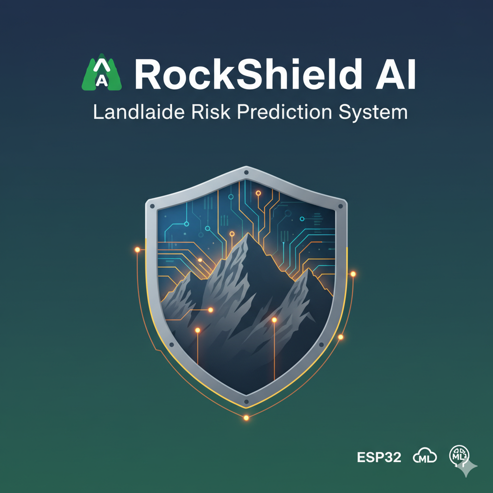

# ⛰️ RockShield AI: Landslide Risk Prediction System

## 🏆 Project Badges

---

## ⚡ Live Demo

Watch the system sample data, process the risk via the ML API, and trigger the local alert when a "Landslide Event" is detected with high confidence (> 80%).

---

## ⚙️ Project Overview

This project implements a complete end-to-end **Landslide Risk Prediction System** using an **ESP32** microcontroller, various **environmental sensors**, a **Machine Learning (ML)** model, and two cloud services — a custom **ML API** and **ThingSpeak** for data visualization.

---

## ⚙️ 1. Hardware & Components

| Component                | Purpose                                         | Pins Used in `RockShield_AI.ino`     |
|--------------------------|-------------------------------------------------|--------------------------------------|
| **Microcontroller**      | ESP32(WiFi required)                            | N/A (Standard for power/programming) |
| **DHT11**                | Measures Air Temperature and Humidity           | D2 (`DHTPIN`)                        |
| **Soil Moisture Sensor** | Measures soil water content (Analog)            | D34 (`SOIL_PIN`)                     |
| **Vibration Sensor**     | Detects ground movement/vibrations (Digital)    | D27 (`VIBRATION_PIN`)                |
| **Buzzer**               | Local Alert for high-confidence Landslide Event | D25 (`BUZZER_PIN`)                   |

---

## 💻 2. Software and Workflow

The system is composed of two main parts — the **Edge Device (ESP)** and the **Cloud Backend (ML/IoT)**.

---

### 2.1. Arduino Code (`RockShield_AI.ino`)

The microcontroller code performs the following core logic:

#### 🔹 Initialization
- Sets up serial communication.
- Initializes the DHT sensor.
- Configures all sensor and buzzer pins.

#### 🔹 WiFi Management
- Connects to the WiFi network in `setup()`.
- Includes a robust `ensureWiFiConnected()` helper to automatically reconnect if the connection is lost.

#### 🔹 Timed Sampling
- Reads sensor data (Temperature, Humidity, Soil Moisture, Vibration) every **15 seconds** (`interval = 15000`).

#### 🔹 ML API Communication (Primary)
- Packages sensor readings into a JSON payload (`temperature`, `soil_moisture`, `vibration`).
- Sends a POST request to the **ML Server (`mlServer`)**.
- Implements a retry mechanism (up to 3 attempts) for failed HTTP calls.

#### 🔹 Alert Triggering
- If the ML response is **"Landslide Event"** and the probability is **greater than 0.8**, the **local buzzer** is triggered for a rapid sequence of 4 beeps.

#### 🔹 ThingSpeak Integration (Secondary)
- Constructs a GET request URL to send all sensor data (`humidity`, `temperature`, `soil_moisture`, `vibration`) to the **ThingSpeak channel (`thingSpeakServer`)**.
- Uses a retry mechanism for reliable data logging.

---

### 2.2. Machine Learning Backend (`RockShield_AI.ipynb` - Conceptual)

The Python Notebook outlines the steps to build and deploy the ML model as the **`mlServer` REST API**.

#### 🔹 Data Preparation
- Loads the dataset (e.g., `landslide_merged_demo.csv` from kaggle).
- Defines the label as the target and separates features.

#### 🔹 Model Pipeline
Uses a **scikit-learn Pipeline** for a standardized ML workflow:
1. `SimpleImputer(strategy="mean")` — Handles missing values.
2. `StandardScaler()` — Normalizes features.
3. `RandomForestClassifier` — Core classification model predicting:
   - `Stable`
   - `High Risk`
   - `Landslide Event`

#### 🔹 Training & Saving
- Achieves ~**87.5% test accuracy**.
- Saved as `rf_landslide_classifier.pkl` for deployment.

#### 🔹 Prediction Function
A helper function `predict_risk(input_dict)`:
- Accepts new sensor data.
- Returns the **predicted class** and **probability distribution**, which the ESP device consumes.

---

## 🔑 3. Configuration

Secure credentials and server addresses are managed in **`config.h`**.

| Constant           | Description                      | Value Type    | Used In                       |
|--------------------|----------------------------------|---------------|-------------------------------|
| `ssid`             | Your WiFi Network Name           | `const char*` | WiFi connection               |
| `password`         | Your WiFi Password               | `const char*` | WiFi connection               |
| `mlServer`         | URL for custom ML Prediction API | `const char*` | `HTTPClient::begin (ML Post)` |
| `thingSpeakServer` | Base URL for ThingSpeak API      | `const char*` | `HTTPClient::begin (TS Get)`  |
| `apiKey`           | Your ThingSpeak Write API Key    | `String`      | ThingSpeak URL parameter      |

> ⚠️ **Note:** Update all values in `config.h` with your own WiFi and server credentials before compiling.

---

## ▶️ 4. Quick Start

1. **Set up ML API:**
   Deploy the trained Random Forest model (`rf_landslide_classifier.pkl`) to a cloud service (Django) accessible via the `mlServer` URL.

2. **Configure Arduino:**
   Update `ssid`, `password`, `mlServer`, and `apiKey` in `config.h`.

3. **Wire Hardware:**
   Connect sensors and the buzzer according to pin definitions:
   `D2 (DHT)`, `D34 (Soil)`, `D27 (Vibration)`, `D25 (Buzzer)`.

4. **Upload Code:**
   Compile and upload `RockShield_AI.ino` to your ESP board.

5. **Monitor:**
   Open the Serial Monitor to view:
   - Sensor readings
   - WiFi connection status
   - ML API responses
   - ThingSpeak updates
   - Local buzzer alerts

---

🚀 **RockShield AI** — Blending IoT, ML, and Edge Intelligence for Safer Hillsides.
